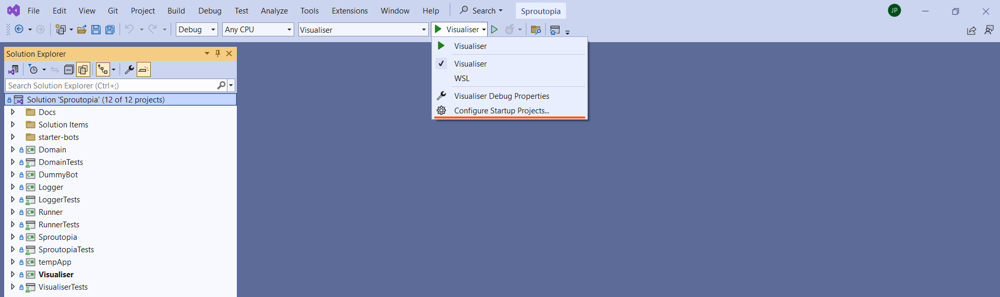
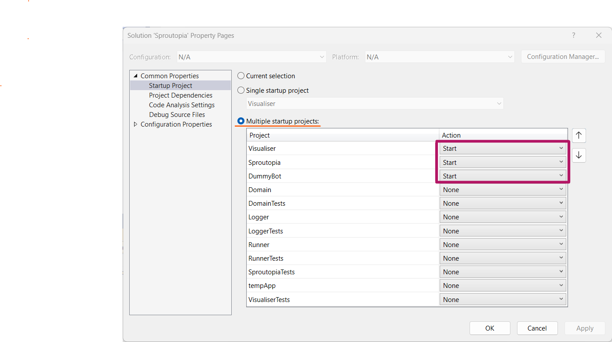
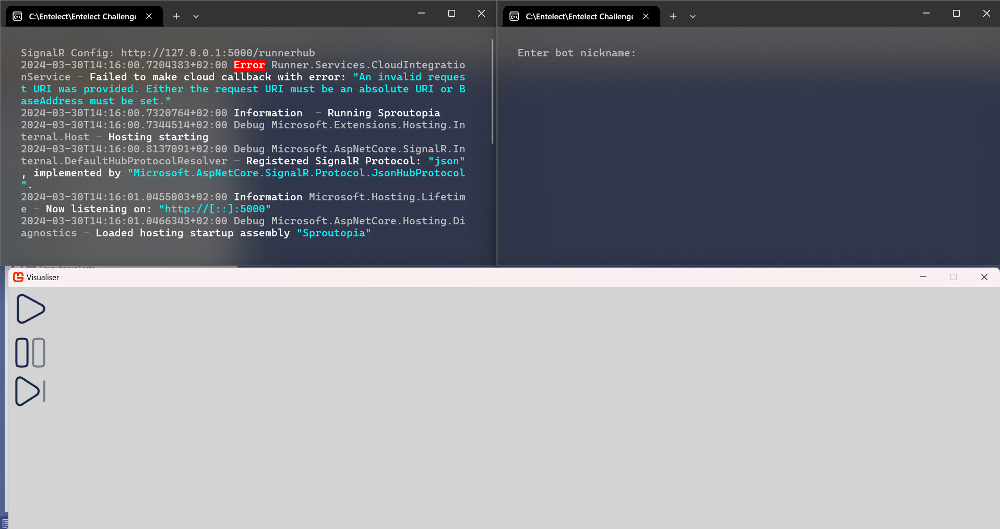
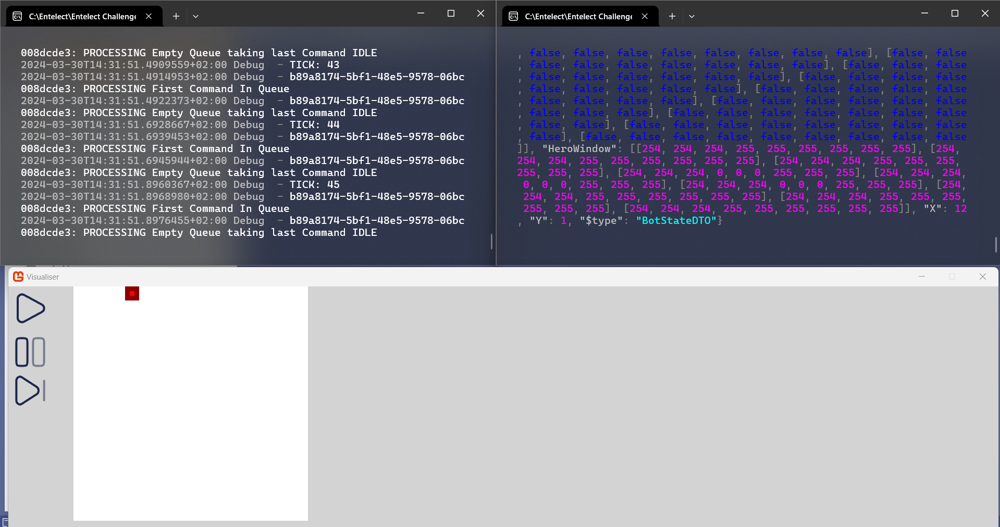
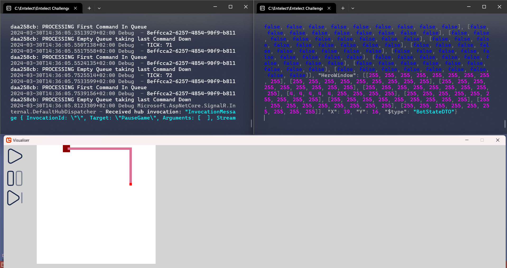

# Entelect Challenge 2024 - Sproutopia 🌱 - Release 2024.0.0

The Entelect Challenge is an annual coding competition where students, professional developers, and enthusiasts develop an intelligent bot to play a game.

This year, the game is Sproutopia 🌱!

---


>#### Refer to GAMERULES.md FOR change log
>
> Best regards and good luck!

---

We have made it as simple as possible to get started. Just follow the steps below.

## Step 1 - Download
Download the zip file and extract it to the folder you want to work.

## Step 2 - Run
The application can be run using docker via the following commands from the root of the project:

##### Windows Command Prompt / PowerShell:
```powershell
.\run.cmd
```

##### Linux / MacOS / Unix:
```powershell
./run.sh
```

These scripts will build the Docker image if it doesn't exist and run it. If the image already exists and you want to force rebuilding it for some reason, you can pass in the `-b` or `--build` command line argument to the script.

## Step 3 - Upload
Sign up to the player portal [here](https://challenge.entelect.co.za/login), and follow the steps to upload your bot and participate in tournaments!

## Step 4 - Improve
Customize the provided logic or create your own to enhance one of the given starter bots, and then upload it to the player portal to see how it stacks up against the competition!

## Step 5 - Test (Optional)

 To create the best possible testing experience, and help our newest players hit the ground running.
 The Entelect Challenge now comes packaged with a visualiser and testing bot (dummy bot)!
 
 To run the visualiser and dummy bot see the instructions below:
> ℹ️: For simplicity, this example will be done using  Visual Studio 2022

1. Open the `Sproutopia.sln` in Visual Studio 2022
1. Note the following projects in your IDE

1. Select the `Configure Startup Projects...`

1. In the `Startup Project` section select `Multiple startup projects` and select the following projects (order dose not matter):
   * `Visualiser`
   * `Sproutopia`
   * `DummyBot` (if you would like to run multiple bots you can startup each project individually) 
   
1. Note the following setup

1. Press the play button on the `Visualiser` window (bottom of image), this will connect `Visualiser` to the Game Engine
1. On the terminal window running the dummy bot (top left of image) enter a nickname for the dummy bot and hit enter
1. The `Visualiser` should come alive and display the world map

1. Enter `W/A/S/D` in the dummy but terminal to see your bot move!



### Additional Features
* The Pause ⏸️ button pauses the game (hit the play ▶️ button again to Unpause)
* The Step ⏯️ button advances the game one tick per click
* The Visualiser independently connects to the Game Engine. Therefore you do not need to use the dummy bot at all. Feel free to connect your own bots and test

## WIN!!!
For more information, visit one of the following:

[Our website](https://challenge.entelect.co.za)

[Our forum](https://forum.entelect.co.za)

Or read the rules in the [game-rules.md](./Sproutopia/GAMERULES.md) file.

## Project Structure

In this project you will find everything we use to build a starter pack that will assist you to run a bot on your local machine. which comprises of the following:

1. **Sproutopia** - This base project contains the following files:
    * **SproutopiaEngine** - The engine enforces the game's rules by applying the bot commands to the game state if they are valid.
2. **Runner** - The runner runs matches between players, calling the appropriate commands as given by the bots and handing them to the engine to execute.
3. **Logger** - The logger captures all changes to game state, as well as any exceptions, and writes them to a log file at the end of the game.
4. **StarterBots - Coming Soon** - Starter bots with limited logic that can be used as a starting point for your bot. This folder also contains a bot called `ReferenceBot`, which you can use to test your bot against!

This project can be used to get a better understanding of the rules and to help debug your bot.

Improvements and enhancements will be made to the game engine code over time.

The game engine is available to the community for peer review and bug fixes. If you find any bugs or have any concerns, please [e-mail us](mailto:challenge@entelect.co.za) or discuss it with us on the [forum](http://forum.entelect.co.za/). Alternatively submit a pull request on Github, and we will review it.

## Submission Process
We have automated submissions through GitHub!
For more information, sign up for the player portal [here](https://challenge.entelect.co.za/login), and follow the steps!